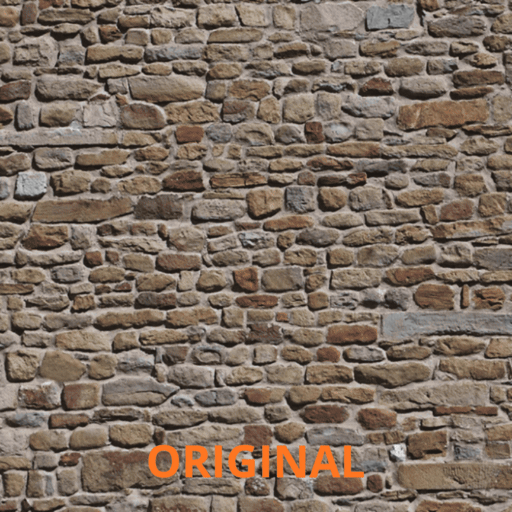

# Laplacian Pyramid

[](https://github.com/KKuubaaaC/laplacian-pyramid/actions/workflows/ci.yml)
[](LICENSE)
[](CMakeLists.txt)

C++17 implementation of the Laplacian pyramid (Burt & Adelson, 1983) for multiresolution
image decomposition, reconstruction, and spline blending. OpenCV is used only for I/O and
matrix storage — all arithmetic is implemented from scratch.

---

## What is implemented from scratch

| Operation | Details |
|-----------|---------|
| Gaussian blur | Separable 1D convolution, branchless inner loop, reflect-101 border handling |
| Add / Subtract | Raw `ptr<float>` loops, signed float — no 8-bit clipping |
| Downsample | Even-pixel stride, no interpolation |
| Upsample + ×4 energy compensation | Zero-insertion + `kExpandKernel` (loop-fused, no separate scaling pass) |
| Multiresolution blend | Per-level weighted sum: `LS[i] = GM[i]·LA[i] + (1−GM[i])·LB[i]` |

**OpenCV provides only:** `imread`, `imwrite`, `cvtColor`, `convertTo`, `cv::Mat`.

---

## Requirements

| Tool | Version |
|------|---------|
| C++ compiler | C++17 (GCC ≥ 9, Clang ≥ 10) |
| CMake | ≥ 3.14 |
| OpenCV | ≥ 4.0 — modules `core`, `imgproc`, `imgcodecs` |
| GoogleTest | system `libgtest-dev` or auto-fetched via `FetchContent` |

---

## Build

```bash
# Release
cmake -B build -DCMAKE_BUILD_TYPE=Release
cmake --build build -j$(nproc)
ctest --test-dir build --output-on-failure

# Debug — AddressSanitizer + UndefinedBehaviorSanitizer enabled automatically
cmake -B build -DCMAKE_BUILD_TYPE=Debug
cmake --build build -j$(nproc)
ctest --test-dir build --output-on-failure
```

---

## Usage

```bash
# Single image — grayscale or color (auto-detected)
./build/pyramid_demo <image> [levels]          # levels ∈ [1, 8], default 6

# Multiresolution blend
./build/pyramid_demo --blend <img_a> <img_b> <mask_gray> [levels]
# mask: white = take from A, black = take from B
```

C++ API:

```cpp
#include "pyramid/laplacian_pyramid.h"

pyramid::PyramidParams params;
params.num_levels = 6;

auto pyr = pyramid::LaplacianPyramid::Build(image_f32, params);
if (pyr) {
    cv::Mat reconstructed = pyr->Reconstruct();
}
```

Output is written to `output/`:

- `laplacian_00.png` … `laplacian_NN.png` — band-pass layers (zero mapped to 128)
- `reconstruction.png` — round-trip result
- `mosaic.png` — all levels in a single image

---

## Visualization



*Iterative decomposition into band-pass frequency layers. Each level captures detail
lost during Gaussian downsampling. Summing all levels reconstructs the original.*

---

## Reconstruction quality

| Input | PSNR (float32 round-trip) |
|-------|--------------------------|
| Random 256×256, 6 levels | ~171 dB |
| Random 512×512, 4 levels | ~165 dB |
| Linear gradient, 6 levels | ~230 dB |
| All-zero image | ∞ (MSE = 0) |

Float32 ULP noise floor is ~138 dB theoretical. Values above this reflect deterministic
cancellation of the Laplacian residuals, not a measurement artifact.

---

## Performance

Measured on Apple M1 Pro, Release build, `test_512.png` (512×512 grayscale), 4 levels,
average of 20 runs.

| Step | This implementation | `cv::buildPyramid`* |
|------|-------------------:|--------------------:|
| Build | ~0.55 ms | ~2.83 ms |
| Reconstruct | ~0.37 ms | — |

\*`cv::buildPyramid` builds a Gaussian pyramid only — not a direct comparison.
The scalar from-scratch loops outperform it here due to cache-friendly row-pointer access
and a branchless inner loop that the compiler fully unrolls.

---

## Design decisions

**`CV_32FC1` throughout.** 8-bit subtraction silently wraps negative differences to zero,
corrupting every Laplacian level. Float preserves sign and avoids quantization error across
all pyramid levels.

**`CV_Assert()` for input validation.** `assert()` is a no-op under `-DNDEBUG`.
`CV_Assert()` fires in both Debug and Release, throwing `cv::Exception` with file and line
information.

**Move-only `LaplacianPyramid`.** Copy constructor is deleted. Accidental copies of large
image vectors are a compile error, not a runtime surprise.

**`std::optional` for `Build()`.** No exceptions in the processing path. The caller is
forced by the type system to handle the failure case.

**`kExpandKernel` loop fusion.** The ×4 energy correction is absorbed into the kernel
weights (`kBurtAdelsonKernel × 2` per pass, net ×4), eliminating a separate O(N) scaling
loop after the blur.

**Branchless inner loop + border zones.** `ConvolveRows` and `ConvolveCols` are split into
three zones: left border, branchless inner (no conditionals), right border. The hot path
contains no branches.

---

## Tests

39 GoogleTest cases across two executables:

| Executable | Cases | Scope |
|------------|------:|-------|
| `pyramid_tests_api` | 22 | Public contract only — no `src/` headers |
| `pyramid_tests_internal` | 17 | `image_arithmetic`, `separable_filter` internals |

Notable cases: PSNR floors (160 dB random, ∞ zero image, >220 dB linear gradient),
blend mask identity (all-ones → A, all-zeros → B), rectangular aspect ratio,
float64-vs-float32 precision bound, `ReflectIndex` boundary values.

---

## CI

GitHub Actions on every push and pull request to `main`:

1. `clang-format` — `--dry-run --Werror` on all tracked `*.cpp` / `*.h`
2. `build-and-test` (runs after format check passes):
   - Debug build with ASan + UBSan
   - `clang-tidy` on every `src/*.cpp`
   - `ctest` (39 tests)
   - Release build + `ctest`
   - Smoke test: `pyramid_demo data/test_512.png 4`

---

## Project structure

```
include/pyramid/          # Public API
├── laplacian_pyramid.h   # LaplacianPyramid — Build(), Reconstruct()
├── pyramid_blend.h       # BlendLaplacianPyramids()
├── pyramid_types.h       # PyramidParams
└── pyramid_utils.h       # ComputePSNR()

src/                      # Implementation (not part of the ABI)
├── separable_filter.cpp  # GaussianBlur, ConvolveRows/Cols, ReflectIndex
├── image_arithmetic.cpp  # Add, Subtract, Downsample, Upsample
├── laplacian_pyramid.cpp # Reduce, Expand, Build, Reconstruct
├── pyramid_blend.cpp     # BlendAtLevel, CollapseBlendedPyramid
├── pyramid_utils.cpp     # ComputePSNR
└── main.cpp              # CLI, I/O, benchmark

tests/
├── laplacian_pyramid_test.cpp   # Public API tests
├── image_arithmetic_test.cpp    # Internal arithmetic tests
└── separable_filter_test.cpp    # Filter and kernel property tests

data/
└── test_512.png          # Synthetic 512×512 grayscale, CC0
```

---

## License

MIT — see [LICENSE](LICENSE). Copyright © 2026 Jakub Cisek.
